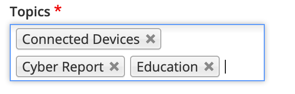
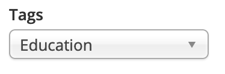

# Overview of Taxonomy form widgets



Taxonomy fields offer a variety of form widgets to facilitate content management. Some form widgets allow you to select from pre-created categories, while others may allow content editors to create new categories \(or taxonomy terms\) as they create and manage content.

Taxonomy form widgets are configured by the Site Builder, or the agency that built your website.

#### Tag-style

The Tag-style form widget allows you to select from pre-created taxonomy terms. The widget allows you to search and select one or more taxonomy terms from large vocabularies. Terms are populated in the form in tag-style and can be easily removed with a mouse. New taxonomy terms cannot be added using this form widget.

#### Dropdown select

The dropdown select form widget allows you to find and select a single taxonomy term. It’s usually used for small-to-medium taxonomy vocabularies featuring only a few terms \(up to 10\). New taxonomy terms cannot be added using this form widget.

#### Radio-button select

The radio-button select form widget allows you to select a single taxonomy term. It’s usually used for small taxonomy vocabularies featuring only a few terms. New taxonomy terms cannot be added using this form widget.

#### Checkboxes

The checkboxes select form widget allows you to select one or more taxonomy terms. It’s also usually used for small taxonomy vocabularies featuring only a few terms. New taxonomy terms cannot be added using this form widget.

#### Autocomplete text

  

The autocomplete text form widget allows you to find and select terms from existing taxonomy terms or create new terms. This widget can be used for large taxonomies, such as Tags.

## 

