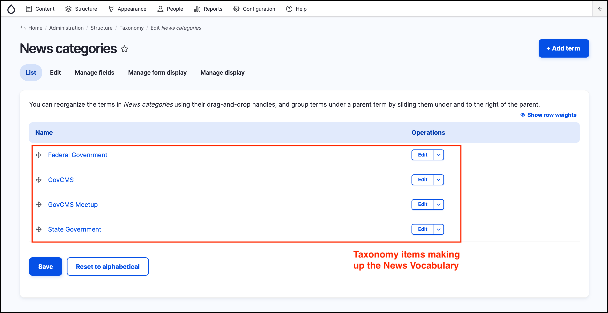
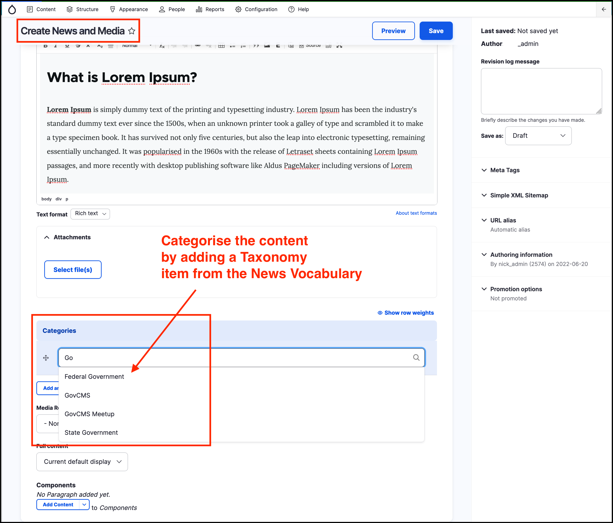

# Taxonomy and Vocabulary



## Definitions

A **taxonomy** in Drupal \(and GovCMS\) is a way to classify or categorise certain types of _content_. 

A **vocabulary** is a **group** of _taxonomy_ items. A _vocabulary_ can only be used to categorise one type of _content_. For example, only the _Event categories_ _vocabulary_ can be used to categorise content of type _Event_.  

These terms and the distinction between them is best illustrated by an example. News articles can be classified or categorised by the **State/Terriroty** they relate to. The categories or _taxonomy_ items would be ACT, NSW, QLD, NT, SA, TAS, WA. The _vocabulary_ in this example would be called **State**. 

## View vocabularies and taxonomy terms \(items\)

To see the list of _vocabularies_ available to use on a site, hover over _Structure_ on the _Admin menu_ then click **Taxonomy**.

Click on the **List terms** to the right hand side any of the _vocabularies_  listed to show the list of _taxonomy_ items it contains. 

In the screenshot below, the list of **News categories** \(_taxonomies_\) is listed.

## Add a taxonomy item to content

When creating _content_ of type _News and Media_, content authors can apply a _Category_ \(_taxonomy_ item\) to the _content_. Only the _vocaulary_ of **News categories** can be used for the _News and media_ content type.

